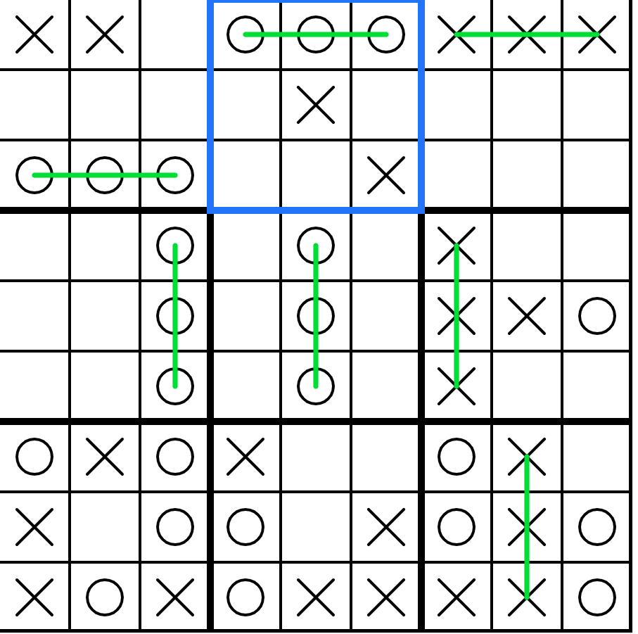

# AI Ultimate Tic Tac Toe
This is a university project in JavaScript on Intelligent Systems (AI) for the Ultimate Tic Tac Toe game.
It uses the P5.js library for the graphics. 

The AI itself is Minimax with Alpha-Beta (α–β) pruning to signficantly speed up the process of travesing the game tree and move options.

## Running the Project
### Simplified
  1. Download the project e.g.: 
 ```shell
 git clone https://github.com/MohamedElBakry/AI-Ultimate-Tic-Tac-Toe.git
 ```
  3. Run it e.g.: 
  ```shell
  python -m http.server
  ```
### Explained
To see the project working, please run it on a local server (localhost) as the P5.js library does not work without it.
For example, if you have NodeJS or Python installed, then from this directory you could run one of the following commands:
  1. `python -m http.server`
  2. `http-server`
  
 ## Example Game
 The following image illustrates a game where the AI won versus the developer of this repo.
 
 
